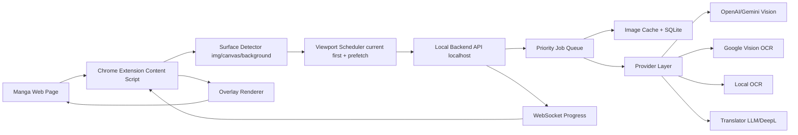

# Universal Manga Translator v2 Design

Date: 2026-06-30

## Decision Summary

Build a new personal-use universal manga translation system and abandon the old `F:\meihua\manga-translate-extension` codebase as an implementation base. The new system uses approach C: a Chrome extension plus a local backend service with pluggable OCR/translation providers. The first implementation will ship OpenAI-compatible vision support while preserving provider boundaries for Google Vision OCR, local OCR, DeepL, and other translators.

The target user experience combines the strongest parts of Torii, Kanfan, and Madomi/Fakey:

- Torii-style image translation capabilities and manual region translation.
- Kanfan-style lightweight browser overlay for arbitrary manga pages.
- Madomi-style smooth reading, whole-page/nearby-page preloading, and cached revisits.

## Goals

- Work across arbitrary manga websites, not only `comix.to`.
- Keep scrolling smooth by moving expensive work to a local backend.
- Prioritize the current viewport and pretranslate nearby images.
- Render translated text using overlays without modifying the original image in the MVP.
- Cache aggressively so repeat images and revisits render almost instantly.
- Support manual region translation and manual text correction.
- Keep providers pluggable so quality, speed, and cost can improve over time.

## Non-Goals for MVP

- Full inpaint text removal.
- Font matching or production-grade typesetting into image pixels.
- Exporting translated PDF/CBZ/image archives.
- Mobile browser support.
- Commercial account, quota, or payment systems.
- Deep iframe support beyond what content scripts can access safely in the first version.

## Overall Architecture



### Module Boundaries

- Extension: detect page surfaces, capture image references or screenshots, schedule by viewport priority, render overlays, provide user controls.
- Backend: download/process images, hash/cache, queue jobs, call providers, normalize OCR/translation results, generate layout data, persist results.
- Shared package: TypeScript protocol types, geometry helpers, result schemas, cache key definitions.

## Extension Design

### Surface Types

The detector must support:

1. `` images, including lazy-loaded images and `currentSrc`/`srcset`.
2. `<picture>/<source>` responsive images through the resolved image source.
3. `<canvas>` surfaces through export when possible or screenshot fallback.
4. CSS `background-image` surfaces by extracting the URL or using screenshot fallback.
5. Webtoon/long-image pages.
6. Accessible iframes later; first version may skip inaccessible cross-origin frames.

### Manga-Likeness Scoring

The generic detector should not translate icons, avatars, ads, or UI. Each surface receives a score based on:

- Minimum visible/rendered size, initially around 300x300 px.
- Visible area and intersection with viewport.
- Aspect ratio resembling manga pages or webtoon strips.
- Repeated similar-size vertical images on the page.
- Centered main-column positioning.
- Exclusion from header/nav/footer/ad-like containers.
- URL/path hints such as manga, comic, chapter, page, webtoon.
- User overrides such as manually included or excluded surfaces.

Only surfaces above the threshold enter scheduling automatically. Low-confidence surfaces remain available for manual inclusion.

### Scheduling

Use a viewport-priority scheduler:

- P0: current viewport or manually requested region; process first.
- P1: next/previous screens based on scroll direction.
- P2: farther same-page or whole-page/whole-chapter pretranslation.
- P3: low-confidence/manual-only candidates.

The scheduler must:

- Reprioritize on throttled scroll and resize.
- Use IntersectionObserver for visibility.
- Use MutationObserver for newly added lazy-loaded content.
- Use ResizeObserver for surfaces whose dimensions change after load.
- Avoid doing CPU-heavy image work in the content script.
- Submit duplicate images only once per configuration.

### Capture Strategy

When submitting a surface, attempt capture in this order:

1. Send `img.currentSrc`/resolved URL to the backend.
2. If backend cannot fetch or the site blocks direct download, use element screenshot/crop fallback.
3. For exportable canvas, use canvas data extraction.
4. For tainted or unavailable canvas, use visible-tab screenshot plus crop.
5. For background images, extract URL first, then fallback to screenshot crop.

### Overlay Rendering

MVP uses overlays rather than modifying the image. Backend returns coordinates in natural image space. The extension maps them to rendered coordinates using surface natural size and rendered rect.

Supported overlay modes:

- Lightweight caption: semi-transparent box with translated text.
- Bubble-fit mode: default; text is positioned inside OCR/vision boxes with automatic font sizing and alignment.
- Debug mode: show boxes, source text, confidence, provider, and timings.

Overlay behavior:

- Follow scrolling, resizing, zoom, and lazy-loaded dimension changes.
- Render cached results immediately.
- Hide/show globally and per site.
- Preserve original images.
- Use pointer events only where interaction is needed.

### Floating Panel

A small collapsible page panel provides:

- Backend connection status.
- Current queue/cache/processing status.
- Translate current screen.
- Translate whole page/chapter.
- Pause/resume.
- Hide/show translations.
- Rescan page.
- Manual region selection.
- Open settings.

Panel requirements:

- Does not block reading.
- Can collapse to a small button.
- Can be dragged or repositioned.
- Saves per-site preferences.

### Manual Editing and Region Translation

MVP includes:

- Click translated box to edit the translation.
- Copy source text.
- Re-translate a single box.
- Delete a box.
- Adjust font size for a box.
- Save manual corrections to cache so they override generated text for the same image hash, target language, and region id.

Manual region flow:

1. User clicks region selection.
2. User drags a rectangle over an image/surface.
3. Extension submits cropped region to backend.
4. Backend processes only that region.
5. Result is rendered over the selected region and cached.

## Backend Design

### Modules

```text
apps/server/src/
  api/          HTTP and WebSocket routes
  queue/        priority job queue and dedupe
  cache/        SQLite and image-file cache
  image/        download, normalize, resize, crop, hash
  providers/    vision/OCR/translation providers
  layout/       box merging, reading order, text layout
  config/       environment and runtime settings
```

### Task Input

The extension submits structured tasks, not raw unlabelled images. Example:

```json
{
  "surfaceId": "stable-id-from-extension",
  "pageUrl": "https://example.com/chapter/1",
  "domain": "example.com",
  "imageUrl": "https://cdn.example.com/001.jpg",
  "imageData": null,
  "viewportPriority": "p0",
  "surfaceRect": { "x": 0, "y": 1200, "width": 980, "height": 1400 },
  "naturalSize": { "width": 1200, "height": 1800 },
  "renderSize": { "width": 980, "height": 1470 },
  "readingDirection": "auto",
  "sourceLanguage": "auto",
  "targetLanguage": "zh-CN"
}
```

### Cache Layers

- L1 extension memory cache for current page and scroll-back rendering.
- L2 backend memory cache for recent and in-flight jobs.
- L3 SQLite structured cache for image hash, provider profile, target language, regions, layout, manual overrides, and status.
- L4 file cache for original, normalized, cropped, and compressed images.

Primary cache key:

```text
image_hash + target_language + provider_profile + layout_version
```

Manual edits extend the key with region identity and override metadata.

### Queue and Concurrency

The queue must support:

- Priority classes P0/P1/P2/P3.
- Duplicate task coalescing by cache key.
- Multiple consumers waiting on the same in-flight image.
- Reprioritization when the user scrolls.
- Cancellation or demotion for far-away tasks.
- Bounded retries with backoff.
- Per-provider and per-domain concurrency limits.
- Timeouts so one bad image cannot block the page.

Initial concurrency targets:

- Image download: 4-8.
- Vision/OCR: 1-3.
- Translation: 2-5.

### Provider Layer

All providers implement a normalized interface that returns regions and layout-ready data.

#### Phase 1 Provider

OpenAI-compatible vision provider:

- Input: normalized image or crop.
- Output: JSON regions containing boxes, source text, translated text, confidence, orientation, kind, and reading order.
- Target language defaults to Simplified Chinese.
- Must include JSON validation and one repair/retry path for malformed model output.

Normalized region result:

```json
{
  "imageHash": "...",
  "regions": [
    {
      "id": "r1",
      "box": { "x": 120, "y": 340, "width": 220, "height": 180 },
      "sourceText": "...",
      "translatedText": "...",
      "confidence": 0.91,
      "orientation": "vertical",
      "kind": "dialogue"
    }
  ]
}
```

#### Later Providers

- Google Vision OCR plus LLM batch translation.
- Local OCR such as manga-ocr or PaddleOCR service.
- DeepL or other translation providers.
- Optional inpaint/typeset pipeline after MVP.

### Layout

Backend emits layout hints so extension rendering stays simple:

```json
{
  "box": { "x": 120, "y": 340, "width": 220, "height": 180 },
  "text": "你在说什么啊？",
  "style": {
    "fontSize": 22,
    "writingMode": "horizontal-tb",
    "align": "center",
    "background": "rgba(255,255,255,0.86)",
    "color": "#111"
  }
}
```

Rules:

- Chinese translations default to horizontal layout.
- Automatically shrink text to fit within region boundaries.
- Merge tiny adjacent text fragments when appropriate.
- Surface overflow with a user-visible expandable state rather than silently losing text.

### Backend API

Initial API:

```text
GET  /health
POST /v1/surfaces/submit
POST /v1/surfaces/cancel
POST /v1/surfaces/retranslate
GET  /v1/surfaces/:id/result
GET  /v1/cache/stats
POST /v1/cache/clear
WS   /v1/events
```

Representative WebSocket events:

```json
{ "type": "job.queued", "surfaceId": "..." }
{ "type": "job.processing", "surfaceId": "..." }
{ "type": "job.cached", "surfaceId": "..." }
{ "type": "job.completed", "surfaceId": "...", "result": {} }
{ "type": "job.failed", "surfaceId": "...", "recoverable": true }
```

## Project Structure

Create a new project at:

```text
F:\meihua\universal-manga-translator
```

Recommended structure:

```text
universal-manga-translator/
  apps/
    extension/
      src/
        content/
          detector/
          scheduler/
          overlay/
          panel/
          capture/
          adapters/
        background/
        options/
      manifest.json
      vite.config.ts

    server/
      src/
        api/
        queue/
        cache/
        image/
        providers/
        layout/
        config/
      data/
        cache.sqlite
        images/
      package.json

  packages/
    shared/
      src/
        types.ts
        protocol.ts
        geometry.ts
        hashing.ts

  docs/
    design.md
    api.md
    troubleshooting.md

  tests/
    fixtures/
    integration/

  package.json
  pnpm-workspace.yaml
  README.md
```

## Technology Choices

- Language: TypeScript.
- Package manager: pnpm.
- Extension build: Vite + Manifest V3.
- Backend: Node.js + Fastify.
- Real-time status: WebSocket.
- Database: SQLite.
- Image processing: sharp.
- Queue: p-queue or a small custom priority queue if p-queue is insufficient.
- Tests: Vitest for unit/integration tests; Playwright for extension E2E.

## Configuration

Extension settings:

- Backend URL, default `http://127.0.0.1:47831`.
- Target language, default `zh-CN`.
- Auto-translate enabled/disabled.
- Prefetch distance.
- Overlay style: caption, bubble, debug.
- Per-site include/exclude rules.

Backend settings:

```text
OPENAI_BASE_URL
OPENAI_API_KEY
OPENAI_MODEL
VISION_PROVIDER=openai-compatible
TARGET_LANGUAGE=zh-CN
MAX_IMAGE_LONG_EDGE=1600
JPEG_QUALITY=0.75
OCR_CONCURRENCY=2
TRANSLATE_CONCURRENCY=3
PORT=47831
```

## MVP Acceptance Criteria

### Functional

- Chrome extension loads successfully in developer mode.
- Local backend starts with one command and reports healthy.
- At least three different manga-style websites can be scanned for main manga surfaces.
- Translate current screen submits visible surfaces and renders results.
- Nearby surfaces are pretranslated while reading.
- Refreshing or reopening the same image uses cache and renders quickly.
- Backend disconnected state is clearly shown in the panel.
- API/provider errors affect only the failed image and can be retried.
- Manual region translation works for one selected region.
- Manual text edits persist and override generated text on cache hits.

### Performance

- Cache hit overlay display target: under 100 ms after surface discovery.
- First uncached ordinary manga image target: first result in 3-8 seconds, depending on model speed.
- Multiple images display incrementally as each completes.
- Page scrolling remains smooth because content script avoids heavy CPU tasks.

### Quality

- Overlay coordinates remain correct after resize/zoom/layout changes.
- Long-image overlays do not drift while scrolling.
- Lazy-loaded images are discovered after load.
- Same image/configuration is not submitted to AI multiple times.
- Backend restart preserves SQLite cache.

## Implementation Phases

1. Skeleton and communication: monorepo, extension shell, Fastify server, health check, WebSocket, basic panel.
2. Universal detection and scheduling: image/currentSrc/srcset detection, manga scoring, observers, viewport priority, include/exclude controls.
3. Backend cache and queue: submit API, image download/receive, hashing, SQLite schema, dedupe, priority queue, cache hits.
4. OpenAI-compatible vision provider: model call, structured JSON, validation, repair/retry, store normalized results.
5. Overlay renderer: coordinate mapping, bubble and caption modes, resize/scroll following, hide/show.
6. Smoothness optimizations: nearby prefetch, scroll-direction prediction, WebSocket progress, dynamic priority updates.
7. Manual region and editing: crop/submit selected region, edit box text, persist overrides.
8. Real-site E2E: verify at least three manga websites, collect screenshots/performance logs, fix acceptance gaps.

## Risks and Mitigations

- Provider latency: mitigate with viewport priority, prefetch, and cache-first rendering.
- Cross-origin image fetching: fallback from backend URL download to extension screenshot/crop.
- Canvas tainting: fallback to visible-tab screenshot crop.
- Model malformed JSON: validate and run one repair/retry path.
- False-positive image detection: use scoring thresholds plus manual exclude/include.
- Large content scripts becoming unmaintainable: keep detector, scheduler, capture, overlay, panel, and protocol modules separate.
- API key exposure: store provider credentials only in local backend `.env`, not in page scripts.

## First Test Site Strategy

If no specific sites are provided, choose:

1. A simple vertically scrolling `` manga site.
2. A webtoon/long-image site.
3. A canvas or custom-reader site.

The exact sites can be selected during implementation or E2E planning.
