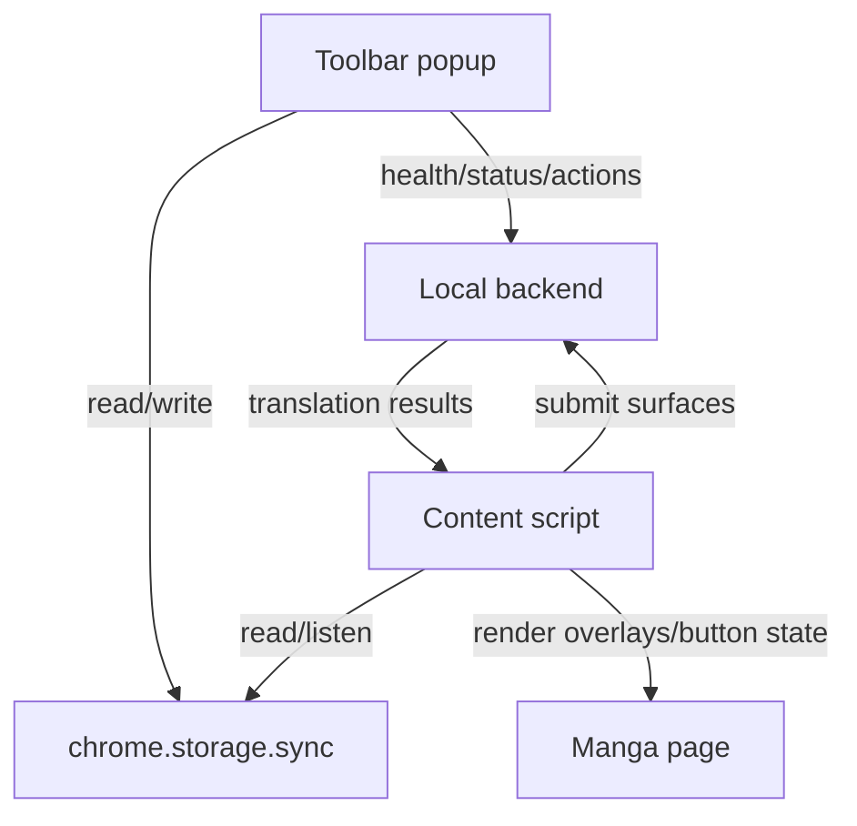

# Extension Popup UI Redesign Design

Date: 2026-07-01
Project: Universal Manga Translator

## Purpose

Redesign the extension experience from a developer-style in-page control box into a polished product-style browser extension UI.

The target interaction model is:

1. The browser toolbar extension icon opens the main control popup.
2. Manga pages only show a minimal optional floating translate button.
3. Translation behavior is controlled by per-site and global settings stored in extension storage and consumed by the content script.
4. The local backend remains responsible for image analysis, OCR/vision translation, caching, manual overrides, and queue/status reporting.

This design intentionally mirrors the successful interaction pattern shown by commercial manga/image translation extensions: a rich toolbar popup for management, and a lightweight page overlay for action/status only.

## Non-goals

- Do not build a full side panel in this phase.
- Do not replace the local backend architecture.
- Do not implement a complete upload-translation workflow in this phase; only reserve a collapsed UI entry if useful.
- Do not add site-specific scraping logic for one manga site. The extension must remain universal across image-heavy comic pages.

## Recommended Approach

Use a Chrome MV3 `action.default_popup` as the main control dashboard, and reduce the content-script UI to a small floating button.

Rejected alternatives:

1. Only restyling the existing floating panel is not enough because it still places complex settings on top of manga content.
2. A full custom side panel is heavier than needed for personal use and would increase implementation scope.

The popup-first model is the best balance of polish, speed, and maintainability.

## User Experience Model

### Browser toolbar popup

When the user clicks the pinned extension icon near the address bar, Chrome opens `popup.html`.

The popup is the primary place for:

- Backend connection status.
- Current site auto-translate state.
- Site scope controls.
- Target language selection.
- Translation model selection.
- Image translation range selection.
- Pretranslation preference.
- Floating button visibility.
- Manual page actions such as refresh display, translate now, pause/resume, and clear current-page cache.

The popup should feel like a product control panel, not a debug tool.

### Page floating button

The content script should render only a minimal floating button on manga pages when enabled.

It should:

- Avoid covering comic images as much as possible.
- Be compact and visually polished.
- Show translation state through label/icon/color, for example idle, translating, complete, paused, or backend offline.
- Trigger current-page translation on click.
- Optionally expand to a very small quick-action menu later, but not contain full settings.

Complex settings belong in the toolbar popup.

## Popup Layout

### Header

The header contains:

- Product name, e.g. Universal Manga Translator or a shorter Chinese display name.
- Compact backend status indicator: connected, offline, mock provider, or configured provider.
- Small icon buttons for settings/options and future help/feedback links.

### Site auto-translate card

Controls behavior for the active tab's website.

Fields:

- Main toggle: enable or disable auto translation for this site.
- Status pill: ON/OFF.
- Scope segmented control:
  - Whole site.
  - Similar path only.
- Small note or link for unsupported-page guidance.

Scope semantics:

- Whole site applies to the current origin.
- Similar path applies to URL patterns with the same origin and comparable path prefix. This is useful for manga chapter pages while avoiding unrelated parts of the same site.

### Translation settings card

Rows:

- Target language select, default Simplified Chinese.
- Translation model select.
- Image translation range segmented control:
  - Viewport: translate visible/near-visible images first.
  - Full page: scan and enqueue the whole document.
- Pretranslate next page toggle.
- Floating translate button toggle.

### Upload translation section

A collapsed row labeled upload translation can be included as a placeholder for future manual image upload translation.

For this phase it should not pretend to support a complete feature. It may open the options page or display a coming-soon disabled state.

### Bottom action row

Actions:

- Translate/refresh current page.
- Pause/resume current page translation.
- Clear current page cache or overrides.

Destructive actions require a confirmation state or second click to avoid accidental cache deletion.

## Settings Model

Extend extension settings with explicit UI and behavior fields.

Global settings:

- `backendUrl`: local backend URL.
- `targetLanguage`: target language code/display value.
- `translationModel`: selected provider/model name.
- `imageRange`: `viewport` or `fullPage`.
- `pretranslateNextPage`: boolean.
- `floatingButtonEnabled`: boolean.
- `autoTranslateDefault`: boolean for sites without an override.

Per-site settings:

- Keyed by origin, with optional similar-path entries.
- `autoTranslate`: boolean.
- `scope`: `origin` or `similarPath`.
- `pathPrefix`: normalized path prefix when scope is similar path.

The content script reads these settings and updates behavior without requiring a full extension reload.

## Data Flow

Popup responsibilities:

- Query active tab.
- Load global and site settings.
- Display backend health.
- Send page actions to the active tab through extension messaging.
- Persist user changes to storage.

Content script responsibilities:

- Detect images/canvas/background images.
- Decide whether to auto translate based on settings.
- Submit surfaces to backend.
- Render translated overlays.
- Show minimal floating button and status.
- Listen for popup commands and storage changes.

Backend responsibilities:

- Serve health/status information.
- Translate submitted image surfaces.
- Cache results.
- Persist manual overrides.
- Optionally expose lightweight queue/provider state for popup display.

## Error Handling

### Backend offline

Popup:

- Show offline state clearly.
- Keep settings editable.
- Disable or soften actions that require backend.
- Provide a short hint to start the local backend.

Floating button:

- Show an offline/error state rather than silently failing.

### Current tab unsupported

If the active tab is a Chrome internal page, extension page, or unsupported scheme:

- Popup should show a friendly unsupported-page message.
- Site-specific controls should be disabled.

### Translation errors

Content script should keep the page usable.

- Failed images should not block other images.
- Existing successful overlays should remain.
- Button/popup status should surface a concise error count if available.

### Cache clearing

Clearing current-page cache or overrides should require confirmation to avoid accidental data loss.

## Visual Direction

The UI should be light, rounded, and spacious, similar to modern browser extension popups.

Suggested style:

- Light background.
- Card sections with subtle border/shadow.
- Orange or blue primary accent.
- Large readable Chinese labels.
- Toggle switches and segmented controls instead of plain debug buttons.
- Consistent spacing and minimum click targets.

The result should look like a real extension settings popup rather than a temporary developer panel.

## Implementation Boundaries

Expected files to add or change during implementation:

- Add `apps/extension/public/popup.html`.
- Add `apps/extension/src/popup/main.ts` and related popup styles/helpers as needed.
- Update `apps/extension/public/manifest.json` with `action.default_popup`.
- Update `apps/extension/vite.app.config.ts` to build the popup entry.
- Refactor `apps/extension/src/content/panel/floating-panel.ts` into a minimal floating button/control.
- Extend shared extension settings types and storage helpers.
- Add extension messaging between popup and content script.
- Add tests for settings migration/defaults, popup rendering logic, and content command handling.

Implementation should preserve the current translation pipeline and backend APIs unless a small status endpoint enhancement is required.

## Testing Strategy

Automated checks:

- Unit tests for settings defaults, persistence, and site-scope matching.
- Unit tests for popup command generation and disabled states.
- Existing build-output regression tests to ensure content script remains compatible with MV3 constraints.
- Full extension build.
- Existing integration/e2e tests.

Manual verification:

- Load unpacked extension from `apps/extension/dist`.
- Confirm toolbar icon opens the popup.
- Confirm settings persist after closing/reopening popup.
- Confirm content page shows only the minimal floating button.
- Confirm changing popup settings affects page behavior.
- Confirm backend offline state is visible and non-destructive.

## Acceptance Criteria

The redesign is complete when:

1. The extension icon opens a polished toolbar popup control panel.
2. The in-page UI is reduced to a minimal optional floating translate button.
3. Site auto-translate can be controlled per origin or similar path.
4. Target language, model, image range, pretranslate, and floating button settings are editable in the popup.
5. Popup shows backend connection state.
6. Popup actions can trigger current-page translate/refresh and pause/resume behavior.
7. Cache/override clearing is protected from accidental clicks.
8. Existing translation, overlay, cache, and backend behavior continue to work.
9. Build and test commands pass.

## Open Decisions Resolved

- Primary UI location: Chrome toolbar extension popup.
- Page UI: minimal floating button only.
- Backend: local backend remains acceptable.
- Scope: universal manga/image-heavy sites, not only one website.